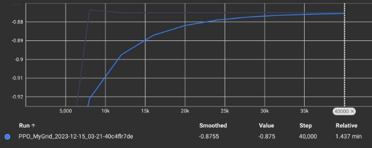
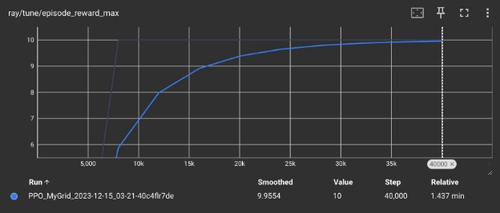

**Parking in Parking Spaces**

**Project Summary**

Parking is a struggle for many drivers around the world. Although it may seem simple, parking accurately in between the allotted lines is something that licenced drivers fail to do at every parking lot across the country. The people who pay for this inadequacy are the other drivers who are no longer able to park in the spaces adjacent to the one that the previous driver parked in because those spaces have other cars overlapping the lines.

Another reason this problem should be solved is because in the process of parking into a space, human drivers oftentime hit the car(s) in the spot next to them. This can lead to unreported hit and run incidents resulting in an innocent driver having to pay for damage repair costs.

We model a good parking simulation by making sure when the “car” enters the space, it never touches either of the lines before it gets to its target.

**State Space**

We model a parking spot in a NxN Gridworld by creating 2 lines which are floor(N/2) long and the target is in between these lines. The agent can be anywhere in this NxN Gridworld.

**Action Space**

Agent can choose to go up, down, left or right as long as it remains within the boundaries.

|**Action**|**Direction**|
| - | - |
|Up|[0,1]|
|Down|[0,-1]|
|Left|[-1,0]|
|Right|[1,0]|

**Rewards**

Hits Target: 10

Hits an Obstacle (Part of Line): -1 Anything else: 0

**RL Algorithm**

PPO (Proximal Policy Optimization) is a type of policy gradient method. It performs “multiple epochs of optimization via stochastic gradient ascent over the surrogate objective, which improves data efficiency.” [[link](https://cameronrwolfe.substack.com/p/proximal-policy-optimization-ppo#:~:text=Additionally%2C%20while%20TRPO%20makes%20only,objective%2C%20which%20improves%20data%20efficiency.)].

**Starting State**

Agent is randomly put on a position that is not on the target and not on the lines.

**Episode End**

Episode ends as soon as the agent is hitting the target or is hitting the obstacle.

**Results**

We can see here that the episode mean increases as the number of steps we take increases. Albeit a slow rise to the convergence of the return of 1, we can see in the following plot that we see the maximum reward of 10 recurring more and more as our steps increase.

This means that our agent no longer hits the obstacles as frequently as it did earlier on in training.
